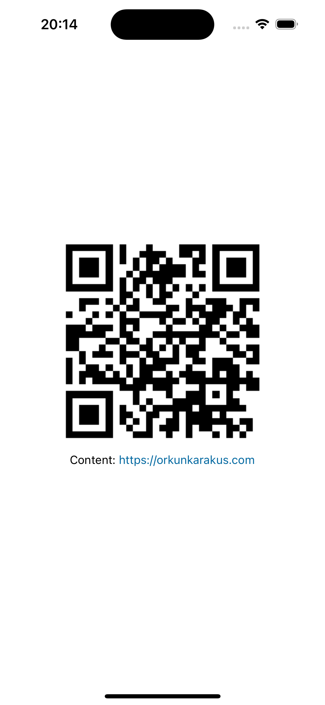

<h1 align="center">React Native QR</h1>

<div align="center">


</div>

<h3 align="center">Qr generator library for react native.</h3>

<div align="center">


</div>

## Features

- Native code based
- Write with Objective-C and Kotlin
- New Architecture support
- Base64 based png export

## Installation

```sh
npm i react-native-qr

# or (yarn)

yarn add react-native-qr

# or (pnpm)

pnpm i react-native-qr

# or (bun)

bun add react-native-qr
```

## Linking

### IOS

You need to install pods

```shell
cd ios && pod install
```

### Android

Autolinking on android side !

## Usage

### Simple

```ts
import { generateQrCode } from 'react-native-qr';

const SIZE = 250;
const TEXT = 'https://orkunkarakus.com';

// ...

const [result, setResult] = useState<string | undefined>();

useEffect(() => {
	generateQrCode(TEXT, SIZE).then((img: string | undefined) => {
		if (!img) {
			return;
		}
		setResult(img);
	});
}, []);

// ...

return (
	// ...

	<Image
		source={{
			uri: result
		}}
		style={{
			width: SIZE,
			height: SIZE
		}}
	/>

	// ...
);
```

## Contributing

See the [contributing guide](CONTRIBUTING.md) to learn how to contribute to the
repository and the development workflow.

## License

- MIT

## Thanks to

- [create-react-native-library](https://github.com/callstack/react-native-builder-bob)

---

<p align="center">
Built with ♥️ by
  <a href="https://orkunkarakus.com" target="_blank">
    <span>Orkun KARAKUŞ</span>
  </a>
</p>
